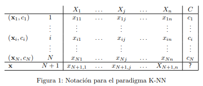
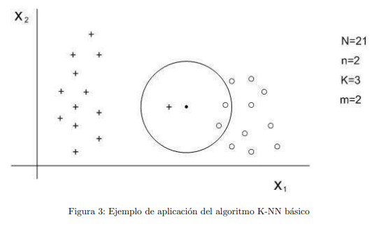
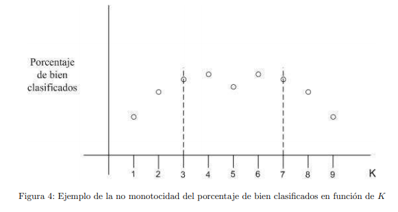
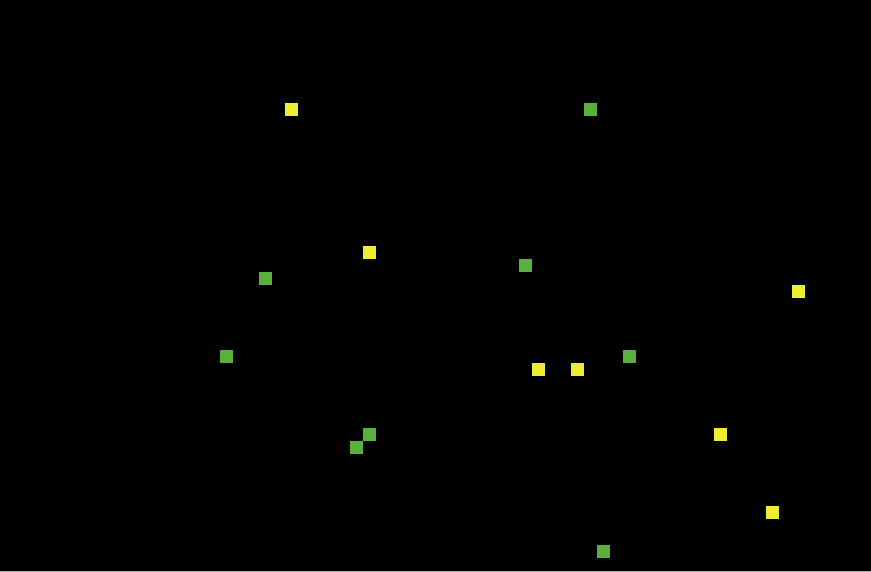
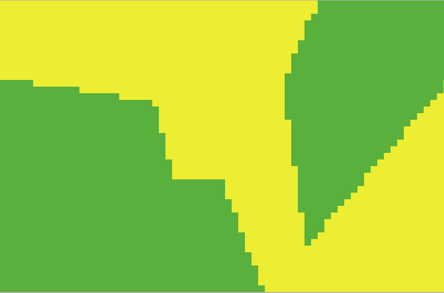
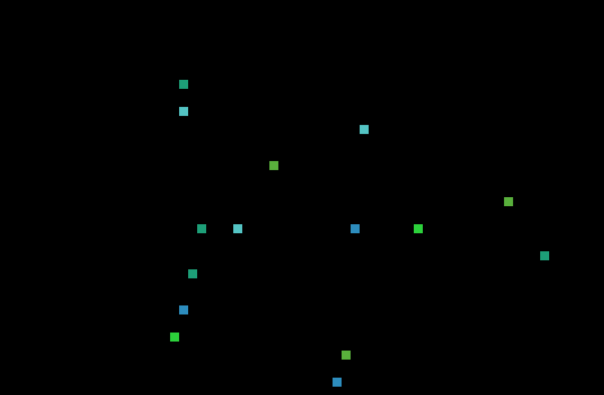
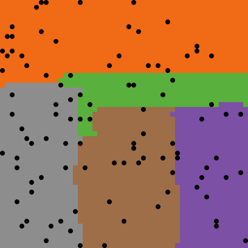

# K-NN CON REDUCCIONES EN EL DATASET.

## ¿Qué es el algoritmo K-NN?

El algoritmo K-NN clasifica cada dato nuevo en el grupo que corresponda, según tenga *k* vecinos más cerca de un grupo o de otro. Es decir, calcula la distancia del elemento nuevo a cada uno de los existentes, y ordena dichas distancias de menor a mayor para ir seleccionando el grupo al que pertenecer. Este grupo será, por tanto, el de mayor frecuencia con menores distancias.

El K-NN es un algoritmo de **aprendizaje supervisado**, es decir, que a partir de un juego de datos inicial su objetivo será el de clasificar correctamente todas las instancias nuevas. El juego de datos típico de este tipo de algoritmos está formado por varios atributos descriptivos y un solo atributo objetivo (también llamado clase).

## ¿Cómo funciona el K-NN?

La notación a usar (véase la Figura 1) en este tema es la siguiente:

- D indica un fichero de N casos, cada uno de los cuales está caracterizado por n variables predictoras,   X1,...,Xn y una variable a predecir, la clase C.

-  Los N casos se denotan por
  -  	(x1, c1), . . . ,(xN,cN)                                         donde
  - ​	       xi= (xi,1...xi,n)                                             para todo i = 1, . . . , N
  - ​	       ci  perteneciente a {c^1, . . . , c^m }      para todo i = 1, . . . , N    

​         c^1, . . . , c^m denotan los m posibles valores de la variable clase C.

- El nuevo caso que se pretende clasificar se denota por x = (x1, . . . , xn).

En la Figura 2 se presenta un pseudocódigo para el clasificador K-NN básico. Tal y como puede observarse en el mismo, se calculan las distancias de todos los casos ya clasificados al nuevo caso, x, que se pretende clasificar. Una vez seleccionados los K casos ya clasificados, Dx(k) más cercanos al nuevo caso, x, a éste se le asignará la clase (valor de la variable C) más frecuente de entre los K objetos, Dx(k).

### Ejemplo de aplicación del algoritmo K-NN básico.

La Figura 3 muestra de manera gráfica un ejemplo de lo anterior. Tal y como puede verse en la Figura 3 tenemos 24 casos ya clasificados en dos posibles valores (m = 2). Las variables predictoras son X1 y X2, y se ha seleccionado K = 3. De los 3 casos ya clasificados que se encuentran más cercanos al nuevo caso a clasificar, **x**(representado por **·**), dos de ellos pertenecen a la clase de circunferencias, por tanto el clasificador 3-NN predice la clase circunferencia para el nuevo caso. Nótese que el caso más cercano a **x** pertenece a la clase cruces. Es decir, que si hubiésemos utilizado un clasificador 1-NN, **x** se hubiese asignado a cruces.

### Determinación del parámetro K.

Una cuestión importante es la determinación del valor de K. Se constata empíricamente que el porcentaje de casos bien clasificados es no monótono con respecto de K (Figura 4 para el ejemplo anterior). siendo una buena elección valores de **K** comprendidos entre **3** y **7**. 

## ¿Qué problema presenta el algoritmo K-NN?

El algoritmo **K-NN** presenta el problema de que requiere mucha memoria y tiempo de ejecución porque hay que almacenar permanentemente todos los datos que forman el espacio de ejemplos con el que se trabaja. Sin embargo, es muy probable que muchas de esas muestras no sean necesarias/determinantes para la clasificación, ya que su información es redundante con las otras existentes. Con el fin de reducir este problema, existen algunas variantes que tienen como objetivo obtener clasificadores similares a los originales, pero reduciendo el tamaño del **dataset** original. 

## ¿Cómo se ha implementado el algoritmo K-NN?

El algoritmo se ha implementado mediante dos funciones principales, K-NN y K-NNGen.

La función K-NN recibe como parámetros el dataset, las coordenadas del punto a evaluar y una variable "k?" que nos indica si queremos tener en cuenta los k vecinos más cercanos al punto, siendo k especificada por el usuario la cual se pasa como parámetro a la función con el nombre de K-User.

Dicha función simplemente se usa para la representación gráfica de la clasificación que realiza el algoritmo para hacerlo más visual de cara al usuario. 

Para empezar se normalizan las coordenadas si el usuario pone a ON el uso de la normalización, ya que las coordenadas pueden ser demasiado grandes como para representarlas. Si el usuario no quiere normalizar las coordenadas tenemos dos variables de normalización que se ponen a 1, para que cuando se usen no introduzcan error en los resultados.

Calculamos las distancias entre las coordenadas, estas divididas entre las variables de normalización dependiendo de si son eje x o eje y. Ordenamos estas distancias en una lista.

Si la variable "k?" es "true" y el tamaño de la lista de las distancias es mayor que k guardamos en una lista llamada vecinos k distancias, desde 0 hasta k, sino las guardamos todas.

La función K-NNGen es la función K-NN pero en esta, la clasificación de puntos se calcula con todas las entradas del DataFrame. En este caso, dicha función recibe como parámetros el DataFrame que se va a usar para clasificar los puntos, una lista de coordenadas, que representa a una línea del DataFrame, la cual queramos clasificar,  K-User, la cual representa a la k que queremos usar y por último una variable k? que nos indica si queremos usar la K recibida como parámetro o usar la longitud de la lista, lo cual nos servirá para implementar los algoritmos de condensación y de reducción.

Para empezar, calculamos la distancia del punto que hemos recibido en la variable coord a los demás puntos que se encuentran en el DataFrame que hemos recibido como df. Una vez hemos calculado todas las distancias ya ordenadas y almacenadas en la variable **distancias**, creamos una sublista con la k que nos hayan especificado según el parámetro **k?** y por último, calculamos que color se repite más usando la moda y lo devolvemos. 

Este caso es similar al de la función K-NN, solo que aquí no hemos tenido que preocuparnos por normalizar nada ya que no la usamos como representación, sino como clasificación.

Una vez hemos explicado el comportamiento de estas dos funciones, la representación gráfica consiste en clasificar todos los puntos del espacio con tan solo dos coordenadas, **X** e **Y**, las cuales se especifican por el usuario en la entrada **ColumnaX** y **ColumnaY**, para ello llamamos a la función K-NN la cual nos devuelve la clasificación de dicho punto en función de x e y, y lo coloreamos en el espacio en función de su clasificación.

## K-NN con Condensación

### ¿En qué consiste la condensación ?

Dado un orden en los datos de entrada, para cada ejemplo se clasifica por medio de K-NN haciendo uso únicamente de los datos anteriores según el orden dado (es decir, el dato xn+1 se clasifica usando K-NN con {x1, . . . , xn}). Si la clasificación obtenida coincide con la real, ese ejemplo se elimina de los datos, si no, permanece. Comprueba que depende del orden dado a los datos y, además, que tiene el problema de conservar los datos que introducen ruido al sistema.

### ¿Cómo funciona el código?

En el código la condensación se realiza de la siguiente manera. En primer lugar se crea una lista vacía que llamaremos "DatosCondensados" donde vamos a guardar las líneas del dataset que sí vamos a utilizar. Mediante un bucle recorremos el dataset original preguntando si "DatosCondensados" está vacío, de ser así, guardamos la línea que estemos evaluando del dataset original en "DatosCondensados" . Si no está vacío, comprobamos  si la clasificación de la entrada actual que queremos añadir es igual a la clasificación que daría el algoritmo K-NN con las entradas que ya hay en el dataset condensado, para ello se llama a la función "K-NNGen".

Para representar el dataset condensado y que el usuario pueda hacerse una idea, guardamos las coordenadas de "DatosCondensados" (primera (x) y segunda (y) columna) en la variable coordenadas, y establecemos el color de los patches en esas coordenadas con el color que les corresponda. A continuación llamamos  a "KNNCondensado" que a su vez llama a la función K-NN que realiza el algoritmo.

Finalmente, con la función "muestraKNN" podemos ver en  el Terminal  los datos que se han excluido del dataset original al aplicar el algoritmo de "K_NN con condensación".

## K-NN con Reducción

### ¿En qué consiste la reducción?

Se comienza con el conjunto completo de datos, y se eliminan aquellos que no afectan a la clasificación del resto de datos de entrada (en contra de la condensación, es capaz de eliminar las muestras que producen ruido, y guarda aquellas que son críticas para la clasificación).

### ¿Cómo funciona el código?

En reducción comenzamos con el dataset completo, por lo tanto hacemos una copia del  dataset original en una lista llamada "DatosReducidos". 

Recorremos el dataset creado comprobando si la clasificación predicha por el "K-NNGen" para el elemento actual es igual a la clasificación real, de ser así, hay que comprobar si la longitud de DatosReducidos es mayor que k para que  almenos en "DatosReducidos" existan siempre tantas entradas como K hayamos definido. Si esta comprobación nos devuelve un valor verdadero(true) borramos la entrada de DatosReducidos.

Y por último, con la función "muestraKNN"  podemos visualizar en el Terminal las entradas de datos que han sido excluidas del dataset original.

## Tratamiento del algoritmo en la práctica con ejemplos

El proyecto incluye dos librerías, una de ellas es "DF.nls" que usamos para cargar los dataset. Y la segunda librería es "GeneticAlgorithm.nls", la cual usamos en nuestro código para poder calcular mediante algoritmos genéticos cual puede ser la K (número de vecinos a tener en cuenta por el K-NN) más óptima para el dataset seleccionado.  

En primer lugar, debemos cargar el archivo(dataset) con el botón "load-DF".Una vez cargado aparecerá una tabla con dichos datos. A continuación si clickamos en "setup" se creará la disposición de los datos en un mapa usando las dos  columnas definidas en "ColumnaX" y "ColumnaY" como coordenadas de cada dato. Todos los puntos tendrán un color basado en la  columna clasificatoria, normalmente, la última.

Los dos primeros ejemplos tendrán una k igual a 10, más tarde, usaremos la función "searchBestK" que mediante algoritmos genéticos nos dará la k ideal para el dataset que estemos usando.

Para el primer ejemplo incluido en los archivos tras realizar estos pasos obtenemos el siguiente mapa:

La clasificación de estos datos es binaria, por eso solo vemos dos colores. 

Si ahora clickamos en "aplicaKNN" obtendremos el mapa dividido según esta clasificación:

Como vemos la división es bastante brusca e ineficaz. Si para el mismo dataset aplicamos primero la condensación, antes de hacer el K-NN, veríamos lo siguiente:

Claramente hay una mejora en la suavidad con la que realiza la división y si nos fijamos en los puntos originales vemos como esta división se acerca mucho más a lo que a primera vista se puede sacar de la primera imagen. 

Vamos a ver ahora un ejemplo con clasificación no binaria, el mapa que obtendríamos cargando el segundo archivo será este:

Para este caso vamos a aplicar el algoritmo de reducción, como se ha indicado antes, este algoritmo es capaz de eliminar las muestras que introduzcan ruido y guardar solo las críticas para la clasificación. 

La perdida de colores representados en el mapa a priori, no nos dice nada, ya que al aplicar reducción borramos las muestras que introducen ruido del dataset y por lo tanto puede haber una muestra con una clasificación única que el algoritmo quiera borrar.

El resultado sería el siguiente:

 											

Como se ha dicho antes podemos calcular mediante algoritmos genéticos cual sería la k ideal para este dataset, y esto lo haríamos pulsando de nuevo el botón "searchBestK". Nos devuelve en la terminal de instrucciones un mensaje indicando la k ideal.

Para este segundo ejemplo nos devuelve una k de 7. Si ahora aplicamos reducción pero con una k igual a 7 obtenemos el siguiente mapa:

Como vemos, al tener en cuenta a menos vecinos cercanos el mapa cambia mucho, pero es más óptimo en este caso al usar la k ideal.

Podemos ver las muestras que el algoritmo ha decidido excluir pulsando el botón "muestraReducción" ("muestraCondensación" en el caso de la condensación).

Por ultimo, si queremos comprobar cual es el error de clasificación que comete el algoritmo K-NN con los datos usados , podemos llamar a la función test desde el botón que aparece en la pestalla de ejecutar llamado test. 

## Obtención de más ejemplos

Hemos añadido una función adicional llamada **creaCSV**, la cual se puede usar para crear nuestros propios DataSets a nuestro gusto. 

Para ello lo que hacemos es permitir que el usuario coloree el mundo con el ratón, de forma que cada vez que haga clic, los patches por los que pase el ratón obtendrán un color diferente. Cuando se haya coloreado todo el mundo con el ratón con tantos colores como queramos, se crearán un número de agentes, los cuales podemos especificar con el deslizador llamado **Entradas**, los cuales se colocarán aleatoriamente por el mundo. Cada agente, representará una línea en el archivo csv. Un pequeño ejemplo sería el siguiente:

Como vemos, las tortugas son los puntos negros que han aparecido en el mundo. Una vez hecho esto, se crea un archivo **.csv** en la carpeta en la que se esté ejecutando el programa con el nombre de **autoCSV-netlogo.csv**. 

Si cargamos dicho archivo, el cual contiene nuestro DataFrame y aplicamos el KNN para ver cuál sería la clasificación que obtendrían todos los demás puntos en función de los que hemos capturado obtenemos lo siguiente:

Vemos que no son exactamente iguales, pero que se parecen bastante.

Esta herramienta, como hemos dicho anteriormente, nos permite crear DataSets a nuestro gusto para poder jugar un poco con el algoritmo del KNN y así poder probarlo tantas veces queramos sin tener que crear un DataSet a mano.

## Conclusiones

Tras realizar diversas pruebas con diversos DataSets, los cuales posteriormente condensábamos y reducíamos para medir las diferencias en cuanto a porcentaje de acierto, hemos determinado que el algoritmo de KNN, es muy rápido pero no es muy preciso. 

Para poder conseguir un espacio de puntos y una clasificación con un porcentaje de acierto mayor al 80%, necesitamos muchos datos y que estén muy limpios, es decir, que tengan poco ruido. 

Dependiendo del DataSet inicial, el algoritmo de condensación a veces daba mejores resultados que el algoritmo de reducción y viceversa, lo cual nos lleva a pensar que ocurre lo mismo que ocurre la gran mayoría de veces en el mundo de la computación y es que no hay una forma mejor que otra de hacer las cosas, sino que dependerá del problema en el que nos encontremos.